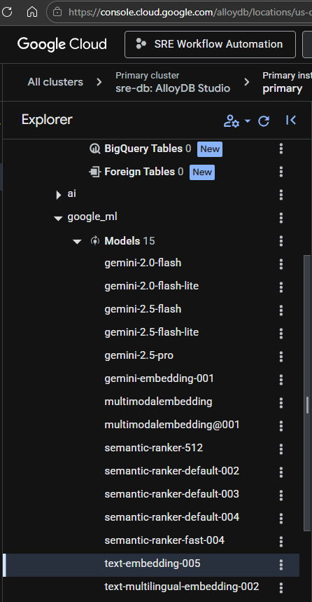

# Learnings
## ADK
1. `google_search` tool return only title, meta description (text below urls), and url of (few, not all) google search results. It does not return rich cards (ai summaries, weather, conversion, calculator), feature snippet, and it also doesn't give url pages content. 

    Thereby, wrapping google_search in an agent is recommended by Google. Wrapping provide various benefits like cleaner reasoning, modularity (task specific searching), and better tools routing (specific agent by type of search). 

2. In alloydb vector embedding, (embedding() is part of the google_ml_integration extension), google has hard coded (text-embedding-005) behind this function. 
    

3. Gemini embedding works better with **natural language structure** , not raw concatenation.
    ```bash
    text = f"""
    This is an item titled "{title}".

    Description:
    {bio}

    It belongs to the category: {category}.
    """
    ```

# Projects
| Project | Concepts Learned |
|---|---|
| [`farmer_assistant`](./farmer_assistant) | ADK agent for crop/farming recommendations, custom tools, and Google Maps API integration |
| [`travel-planing-adk-tools`](./travel-planing-adk-tools) | Multi-agent travel planner utilizing specialized ADK tools |